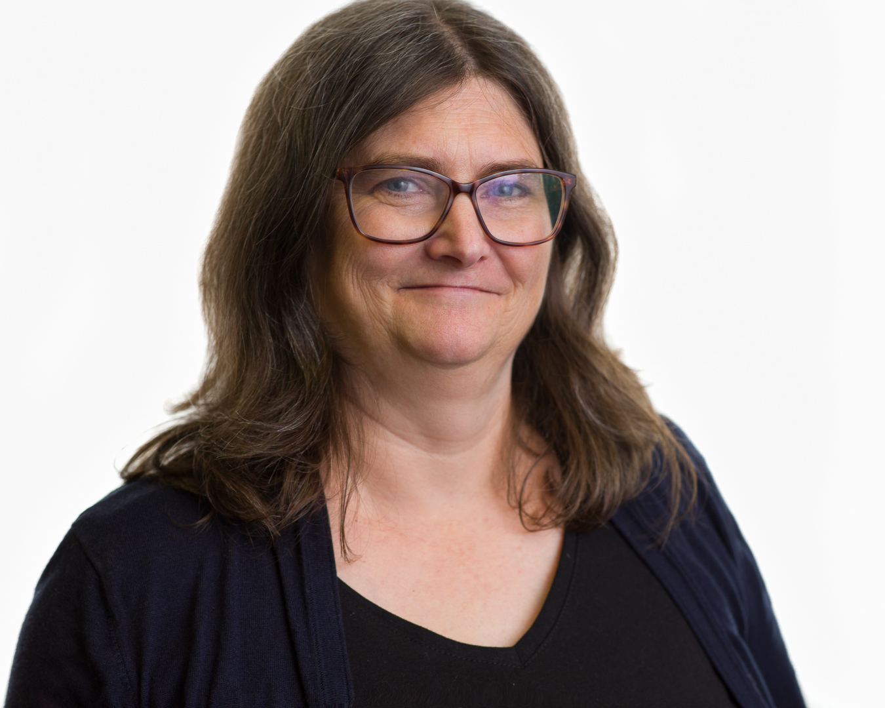

I am a globally recognized expert in Python development and open source
software. As a board advisor and consultant, I guide early-stage organizations,
and leadership teams in the complexities of open source governance, data science, AI,
cloud, and Machine Learning. I am a core Python developer, three-time Python
steering member, and Project Jupyter core contributor.

:::: {layout-ncol=2}

::: {#first-column}

:::

::: {#second-column}

My contributions to science, open source, and technology are felt far and wide: I have
transformed the way students learn with Jupyter notebooks; I’ve contributed and
shared to countless open source projects such as AnitaB.org and CPython; I’ve
advised many organizations in open source governance including Quansight Labs, CZI
Open Source, and pyOpenSci. I am the recipient of the ACM Software System
Award (2017) and the Frank Willison Award for technical and community contributions to
Python (2019). I’m a co-organizer of PyLadies San Diego and San Diego
Python User Group.

:::

::::

Throughout my career, I’ve built a reputation for embracing opportunity, scaling knowledge
through the power of community, and approaching every challenge with curiosity, empathy, and
kindness. I have a track record of building high-performance teams, helping organizations grasp
the complexities of cloud-native environments, and influencing others through mentorship. I
believe in the power of sharing, in the power of community. I also believe that through science
and technology and art, we can discover more about who we are as humans. I’m deeply
committed to sharing my knowledge with others through stories that make the world of
technology and science accessible and relatable—through five-minute mentor moments to a
keynote on a global stage.

When I am not coding or deep in research on data, AI, or cognitive science, you can find me in
my Southern California garden, surrounded by succulents, restoring an old guitar, or building
blinky wearables.

## More about me
