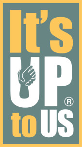

_Note: The links to other sites and this post may have triggers to those healing._

"Lean In" is a popular saying these days. Yes, I think it is great to get more
women (and underrepresented groups) into higher levels of management and more
equity in tech. It's a change that I hope I see in my lifetime.

<!-- more -->

While we are "leaning", let's end the stigma about mental health. From mental
health education to suicide prevention to mental health care accessibility, I
want to see improvements in our world.

Just breathe... That's what I tell myself when things get a little intense or
stressful. Mindfulness can make a person's world more pleasant and peaceful.
Check out the [UCSD Center for Mindfulness](https://ucsdcfm.wordpress.com/)
for more information.

_Source: It's Up to Us website_

San Diego and California have been doing a great job trying to break down
stigma. I love the [It's Up to Us](http://www.up2sd.org/) program that
educates and provides community resources. Young or old. Male or female.  This
site is a great starting point for information.

Let me leave you with a personal challenge: [Know the
Signs](http://www.up2sd.org/know-the-signs). You never know who you will
impact. **Suicide is preventable.**
