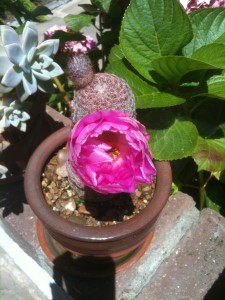

**Distributed Network Data by Alasdair Allan and Kipp Bradford (O’Reilly Media)**

When I pick up a cookbook to try a new recipe, I want to know that the recipe
has been tested and works. If the recipe doesn’t work out, the cookbook gets
tossed on a bottom shelf to gather dust. I hold my technical books to a
similar standard.

<!-- more -->

If you want to create a network of multi-sensor Arduino modules that share
information, this book delivers. The authors’ extensive “hands on” experience
produces a practical recipe for success. Beginners through intermediate users
will appreciate the clarity of steps building from parts to a working network
of sensor modules.

The authors break down this task into three major chunks:

**Building a multiple sensor Arduino module:**
The book’s first six chapters walk a reader through setting up multiple sensors (temperature/humidity,
motion, sound) with an Arduino. Chapter by chapter, the reader learns about
hardware, adding a sensor to work with an Arduino, how to add multiple
sensors, wiring up a breadboard, using Fritzing, and soldering a prototype
multi-sensor module.

**Creating a network of sensor modules:** In this part, the authors dive into
the details of using XBee wireless modules. In one chapter, they cut the USB
cord and show how the XBee can be used for wireless communication. Once the
user masters a single XBee/Arduino sensor module, the books shows how two
modules can be used for point to point wireless communication. Gradually,
the authors give you instruction on how to create a “many to point” or star
network to allow call and response by the modules. Although there is not a
specific tutorial on creating a mesh network, the authors build your skill
level and confidence, and you should be able to tackle the projects in their
suggested book.

**Visualizing and using information from the sensor modules:** Visualizing
data is a broad topic; consider this book as a starting point. Lego
Mindstorm enthusiasts (as well as those looking to create an information
dashboard) will appreciate the chapter on LabView. A suggestion for future
revisions would be to add more detail or resources on how Python can be used
for data visualization using SciPy and NumPy.

Overall, the authors deliver a technically solid book. A reader can build
confidence as they successfully navigate from chapter to chapter -- concept to
working system. If I can find the time, I may place some sensor modules in
multiple places in my own garden to track temperature and humidity and perhaps
use the sound input to provide an alert when the bunnies are eating my
vegetables!
