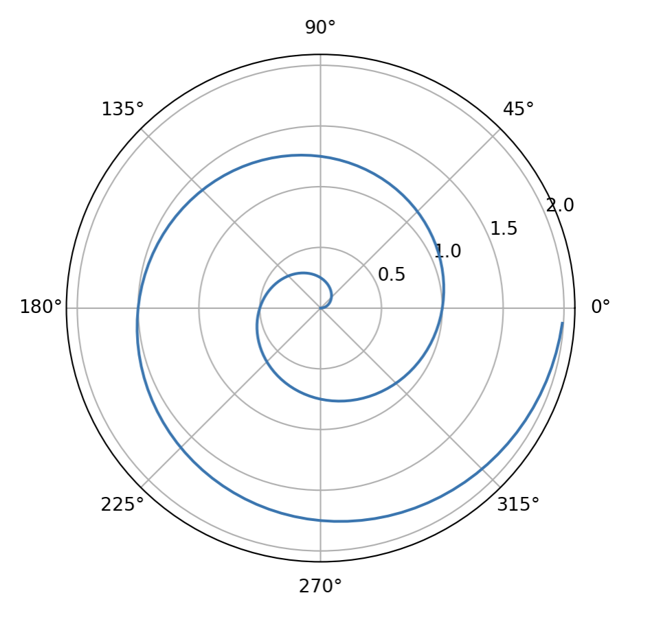

Quarto can run Python cells through a Jupyter kernel and render the results
right into a post. Here are three small experiments: an interactive map, a
polar plot, and a widget. The code below is shown as it was run; the outputs
are captured as images so the page renders without a live kernel.

## An interactive map with ipyleaflet

```python
from ipyleaflet import Map, Marker, basemaps, basemap_to_tiles

m = Map(
    basemap=basemap_to_tiles(
        basemaps.NASAGIBS.ModisTerraTrueColorCR, "2017-04-08"
    ),
    center=(52.204793, 360.121558),
    zoom=4,
)
m.add_layer(Marker(location=(52.204793, 360.121558)))
m
```

In a notebook this produces a pannable, zoomable map with a NASA GIBS true-color
basemap and a marker at the center point.

## A polar plot with matplotlib

```python
import numpy as np
import matplotlib.pyplot as plt

r = np.arange(0, 2, 0.01)
theta = 2 * np.pi * r
fig, ax = plt.subplots(subplot_kw={"projection": "polar"})
ax.plot(theta, r)
ax.set_rticks([0.5, 1, 1.5, 2])
ax.grid(True)
plt.show()
```

{#fig-polar fig-alt="A blue spiral line plotted on a polar axis with gridlines at 0.5, 1.0, 1.5, and 2.0"}

## A widget with ipywidgets

```python
import ipywidgets as widgets

slider = widgets.IntSlider(value=5, max=10)
slider
```

Widgets need a running kernel to be interactive, so they are best enjoyed in
JupyterLab or in a Quarto document rendered with `jupyter: python3` while a
kernel is available.
