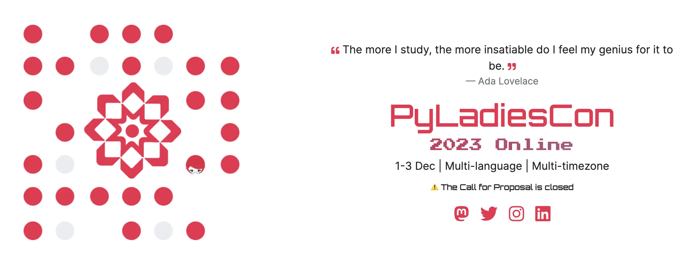
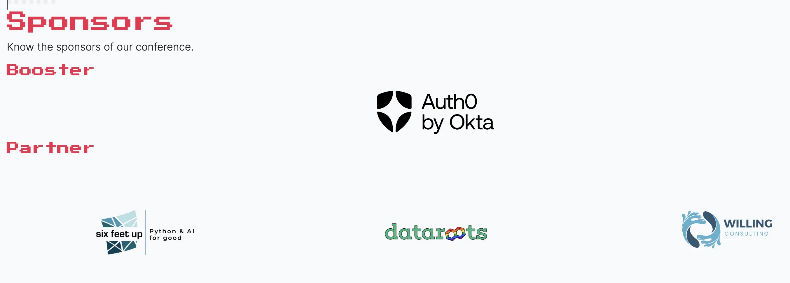
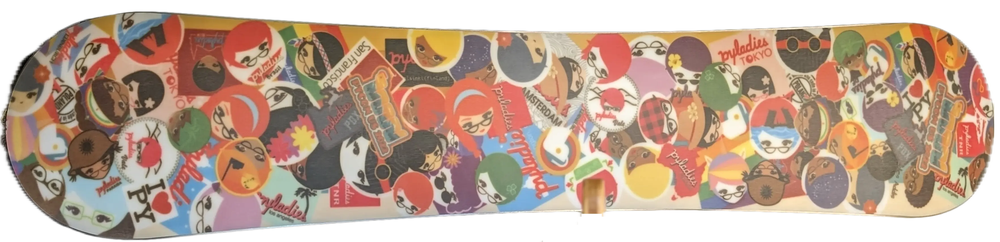

[**PyLadies**](https://pyladies.com) is a special organization that strives to give everyone
the opportunity to learn and grow in Python. PyLadies' mission includes
empowering the current and next generation of Pythonistas through
outreach and education.

## PyLadies at PyCon Sweden

I just returned from PyCon Sweden, a conference organized by their
local Python community. I was honored to be one of the keynote speakers.
We had a PyLadies lunch, organized by the optimistic Anwesha Das and
the PyLadies Stockholm group. I was impressed by the number of PyLadies
at the lunch.

My favorite part of the lunch was listening to talented people from
around the world share their stories. I was especially impressed by
people who have changed careers to work with Python. I also enjoyed
hearing about how Python is being used in libraries and education ---
two areas that have a multiplier effect for Python's growth.

## What's Next?

What's next for PyLadies? I'm excited to see PyLadies continue to grow
and thrive in 2023. One look at the PyCon YouTube channels shows
the breadth and depth of talent in the PyLadies community.

## PyLadies Global Conference (PyLadiesCon)

Taking place on the first weekend of December, PyLadies will gather
together at [PyLadiesCon](https://conference.pyladies.com) for a 
weekend filled with insightful talks, engaging panels, and collaborative
networking opportunities. I can't wait to see the [keynotes](https://conference.pyladies.com/speakers.html) from six global leaders in Python.

The [speakers](https://conference.pyladies.com/speakers.html) and attendees will be around the world. I'm looking forwart to
the talks and learning from each other.

PyLadiesCon is free and open to everyone. If you are able, please consider
a donation to help PyLadies continue to grow and thrive.

## Joining as a Sponsor

To celebrate all which PyLadies has given me for more than a decade, I'm
[sponsoring PyLadiesCon as a Partner](https://conference.pyladies.com/index.html).
Partnership describes well my rich relationship with PyLadies as an organizer,
leader, mentor, learner, and friend.

**I'm thankful for the opportunity to give back to PyLadies.**

## Thank You

