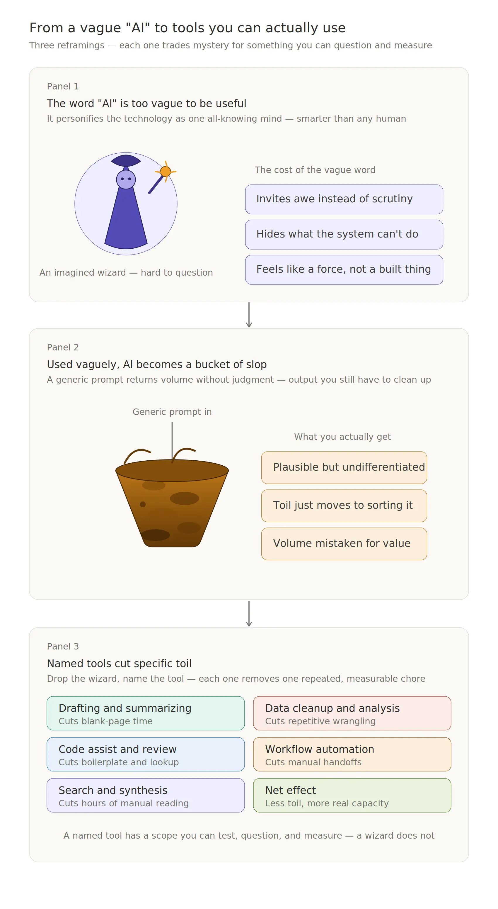

I've been reflecting about my PyCon experience.

I enjoyed moderating a panel in the PyCon AI track with Catherine Nelson, Jodie Burchell, PhD, Jelle Zijlstra, Maike Scherer, and Laís Carvalho about pragmatic workflows using AI tools.

I thought deeply about the messages in the keynotes. I valued the discussions at the Maintainer Summit organized by Mariatta Wijaya, Leah Wasser, Ph.D., and Inessa Pawson. I enjoyed working through Felipe Moreno's zine mystery.

People are the heart of Python. They have created community and code to empower people around the world. Hope, as eloquently shared by Amanda Casari in her keynote, comes from working together for a greater good - the human condition and future generations.

We can change the current narrative.

P.S. If you have design expertise, please refine these ideas.

## From vague "AI" to tools you can use

