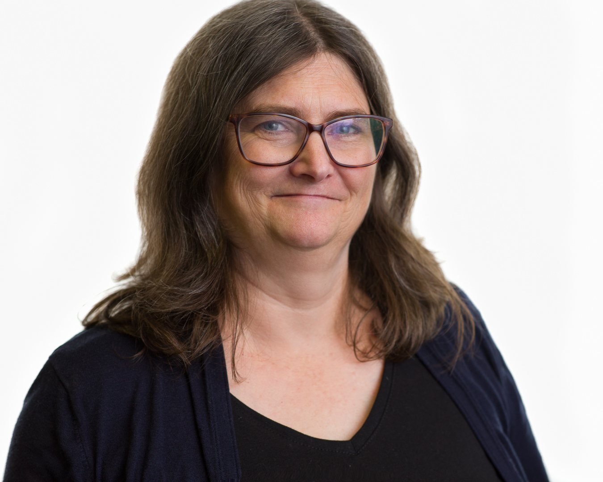

## Bio

**Carol Naslund Willing** serves on Project Jupyter’s Steering Council and works as a Core Developer on JupyterHub and mybinder.org. She serves as a co-editor of The Journal of Open Source Education (JOSE) and co-authored an open source book, Teaching and Learning with Jupyter.

She is a three-term member of Python’s Steering Council and a core developer of CPython. She’s a Python Software Foundation Fellow and former Director. In 2019, she was awarded the [Frank Willison Award](https://www.python.org/community/awards/frank-willison/#carol-willing-2019) for technical and community contributions to Python. With a strong commitment to community outreach, Carol co-organizes PyLadies San Diego and San Diego Python User Group.

Carol has an MS in Management from MIT and a BSE in Electrical Engineering from Duke University.

## Bio (Extended)

**Carol Naslund Willing** can frequently be heard saying “That’s so cool.
How does it work? I would love to learn more about it.” She has enjoyed
developing software and electronics and teaching others for over 20 years.

Growing up on the east coast, she was inspired by nature, the arts, and math.
Wanting to learn more about those interests, she earned a BSE in Electrical
Engineering from Duke University and an MS in Management from MIT. Her
education and work experience in small and large companies taught her to
respect the value of “using what you have learned to make something better
and sharing what you know with others”.

Carol is currently a Steering Council member and developer for [Project Jupyter](https://jupyter.org). She is also a three-term member of the Python Steering Council,
a Python Software Foundation Fellow and former Director;
a core developer on CPython, Jupyter, nteract, AnitaB.org's open
source projects, and PyLadies; a co-organizer of PyLadies San Diego and San Diego
Python User Group; an independent
developer of hardware and software. In 2019, she was awarded the [Frank Willison Award](https://www.python.org/community/awards/frank-willison/#carol-willing-2019) for technical and community contributions to Python. Weaving her love of art, music, and nature
with wearable soft circuits, she is developing an open hardware project to
assist an in-home caregiver with gentle, compassionate support of a loved one
with Alzheimer’s.

Today, she spends much of her time learning and inspiring others to blend
their unique interests and technology to create something new, silly,
beautiful, or helpful.

### Profiles

- [GitHub](https://github.com/willingc)
- [orcid.org ID: 0000-0002-9817-8485](https://orcid.org/0000-0002-9817-8485)
- [OSF.io](https://osf.io/g2k6w/)
- [My OpenHub profile](https://www.openhub.net/accounts/willingc)

## Headshots

