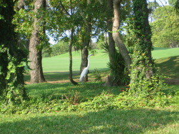

# Thoughts for Tuesday: Tea Leaves

It's been a week.

Last Tuesday, I was listening to keynotes and sharing trivia at LinuxCon 2013.
I also received a phone call that my mom was rushed to the ER with pneumonia.
By Wednesday afternoon, the doctors were recommending that I travel to Florida
as my mom's condition worsened. At 4:00am on Thursday, I packed up my
LinuxCon and Linux Plumbers Conference items and took the first available
flight to Florida. I spent the day with my mom listening to her breathing
mixed with soothing music. At 8:38pm Thursday evening, my mom passed away
peacefully while I stroked her hair and rubbed her shoulder.
<!-- more -->
Since Thursday, the tsunami of memories hit me strong. One moment storms of
thoughts flowed; the next moment brought a quiet, peaceful gratitude. There
are many memories of drinking tea with my mom. It was her daily ritual.

My mom was a lover of all sorts of tea. If the tea leaves could tell their
story of her life, it would be a fascinating 80 year journey. She saw many
changes in her lifetime. As Alzheimer's took so much from her, she remained
pleasant and thankful for what she had.

As I watch the tea leaves swirl in my tea kettle today, I'm thankful that I
had time with my mom last week. As the future unfolds, I'm going to try my
best to be thankful for the people around me who love and inspire me today.
