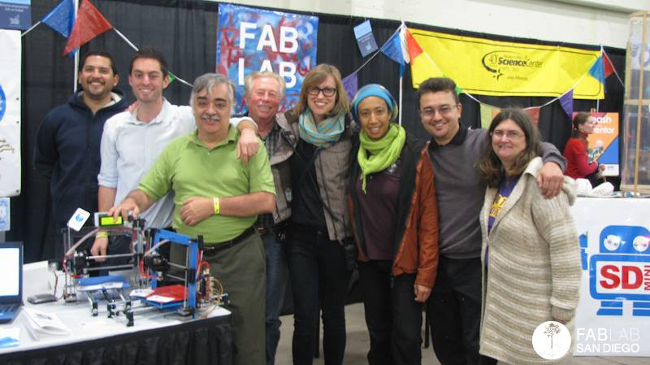
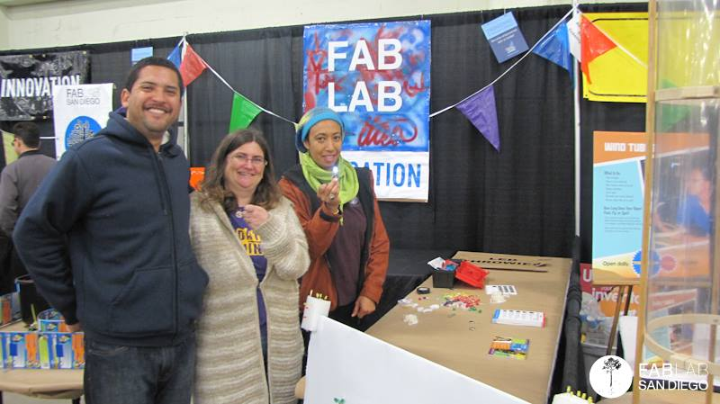
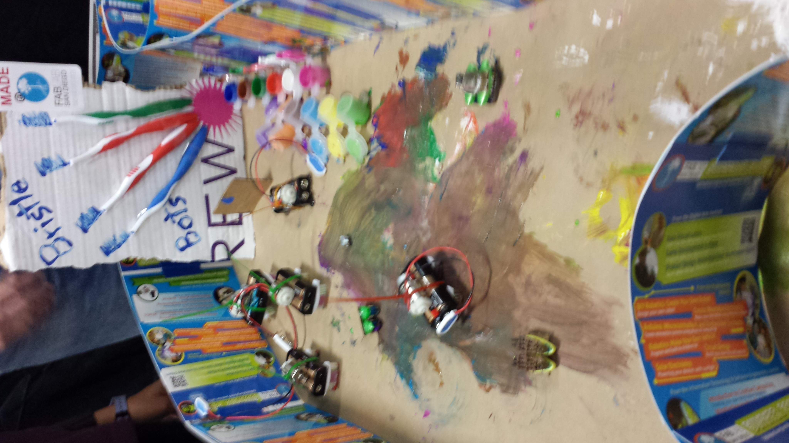
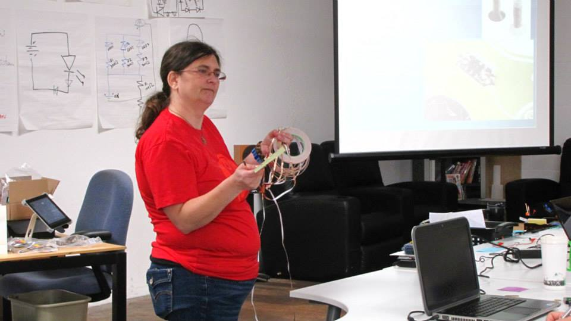
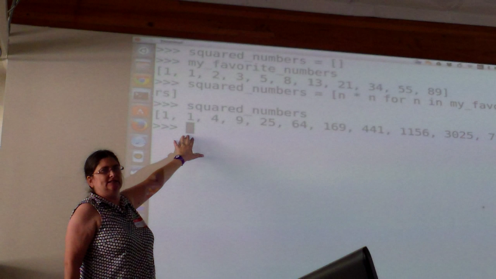
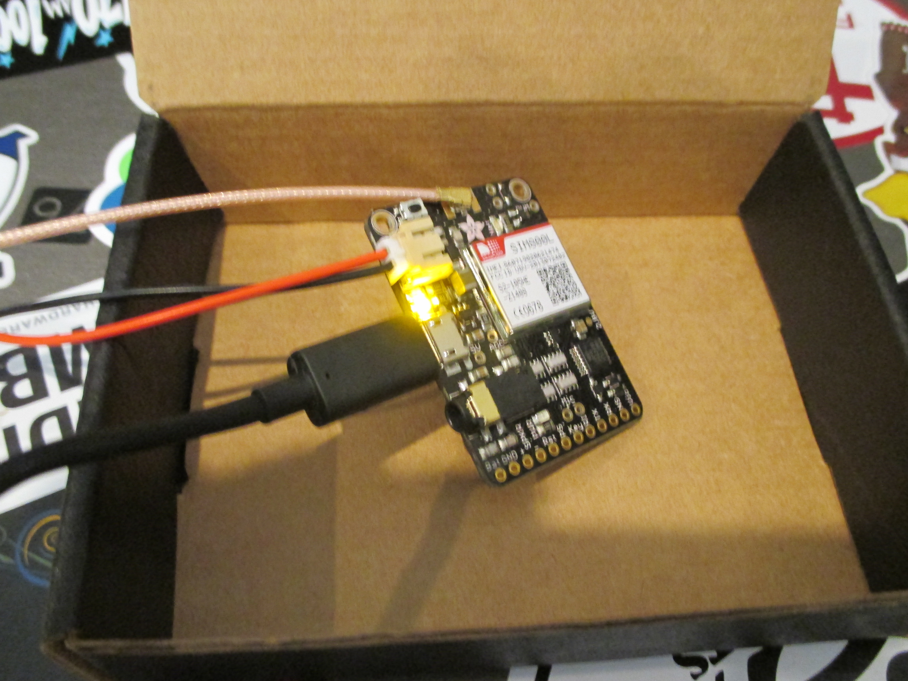

# Building a better community

## Why I gave a $2048 donation to Fab Lab San Diego

**Watching someone bring their idea to life is an amazing reward.**

People from all walks of life have creative ideas. Through grassroots sharing
of ideas, skills, and equipment, [Fab Lab San Diego](http://fablabsd.org)
gives individuals a chance to learn, build, and share their creations. I
believe Fab Lab San Diego's outreach programs inspire students of all ages.
Outreach is hard work but the community benefits are huge.

<!-- more -->

Please join me in [Fab Lab San Diego ReLaunch](http://igg.me/at/fablabsd/x/3914440)
giving what you are able to Fab Lab San Diego. Tell a friend. Send a message.
Donate toward the good work that will be done.
[Fab Lab San Diego ReLaunch](http://igg.me/at/fablabsd/x/3914440). Thank you!

**Fab Lab San Diego - Why?**

<iframe src="https://www.youtube.com/embed/vw3749HLUmo" width="420" height="315" frameborder="0" allowfullscreen="allowfullscreen"></iframe>

## Fab Lab San Diego in the Community

{data-gallery="fablab"}

{data-gallery="fablab"}

{data-gallery="fablab"}

{data-gallery="fablab"}

{data-gallery="fablab"}

{data-gallery="fablab"}
