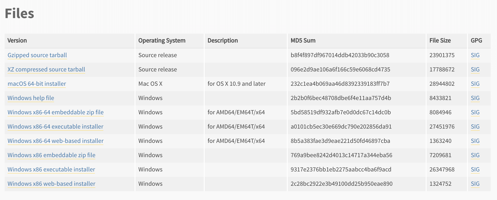
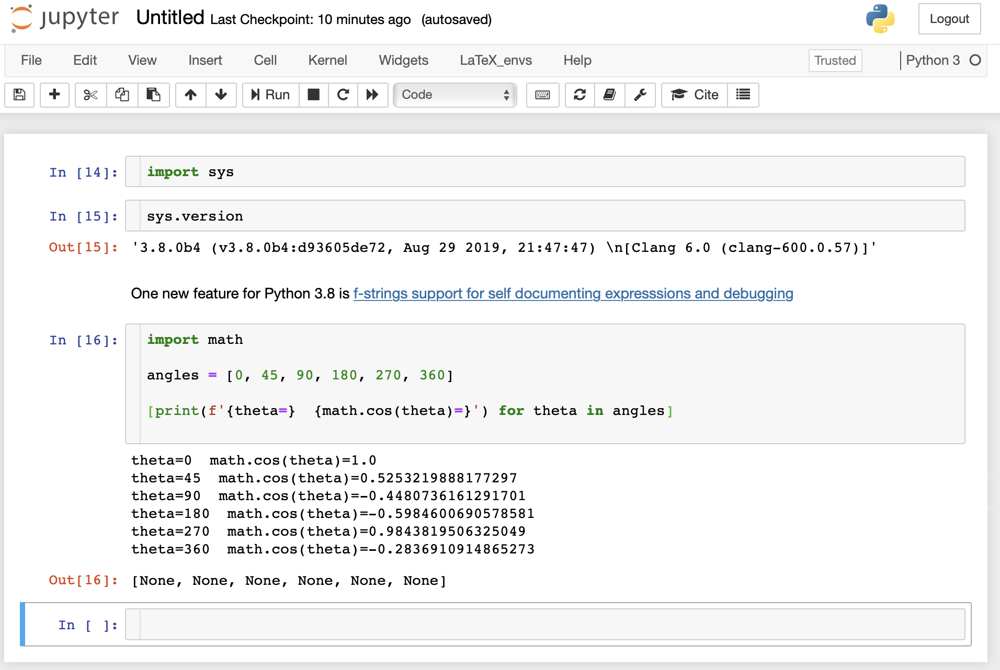

# Trying the Python 3.8 beta with Jupyter Notebook

Trying out a pre-release will help you become familiar with new features to determine if they would be good to use in your projects.

<!-- more -->
## Download the installer

Navigate to the [Python 3.8.0b4 release page](https://www.python.org/downloads/release/python-380b4/). Scroll down to the **Files** section:



To install on macOS, select the link `macOS 64-bit installer` and download the linked `.dmg`
installer. Although this is a pre-release version of 3.8.0, the installer will prompt you
for responses just as it does for released versions such as 3.7.4.

## Check the installation

To check your installation, enter in a terminal:

```bash
python3.8 --version  # should display Python 3.8.0b4
```

## To use the REPL

To use the beta REPL, enter in a terminal:

```bash
python3.8
```

The REPL will launch with the following output:

```python
Python 3.8.0b4 (v3.8.0b4:d93605de72, Aug 29 2019, 21:47:47)
[Clang 6.0 (clang-600.0.57)] on darwin
Type "help", "copyright", "credits" or "license" for more information.
>>>
```

Exit the REPL using Cntl+D or `exit()`.

## Install Jupyter notebook with Python 3.8.0b4

### Create and activate a virtual environment

First, create the virtual environment in a Terminal:

```bash
python3.8 -m venv testenv
```

where `testenv` is the name of the virtual environment.

Activate the virtual environment:

```bash
source testenv/bin/activate
```

You should now see `(testenv)` above your command-line prompt.

### Install the Jupyter notebook

Install `jupyter` using `pip`:

```bash
pip install jupyter
```

### Try it

Enter:

```bash
jupyter notebook
```

The Jupyter notebook interface should launch. Select a new Python3 notebook.

You can now begin exploring the new features in Python 3.8. This example shows
[f-strings support for self-documenting expressions and debugging](https://docs.python.org/3.8/whatsnew/3.8.html#f-strings-support-for-self-documenting-expressions-and-debugging).


