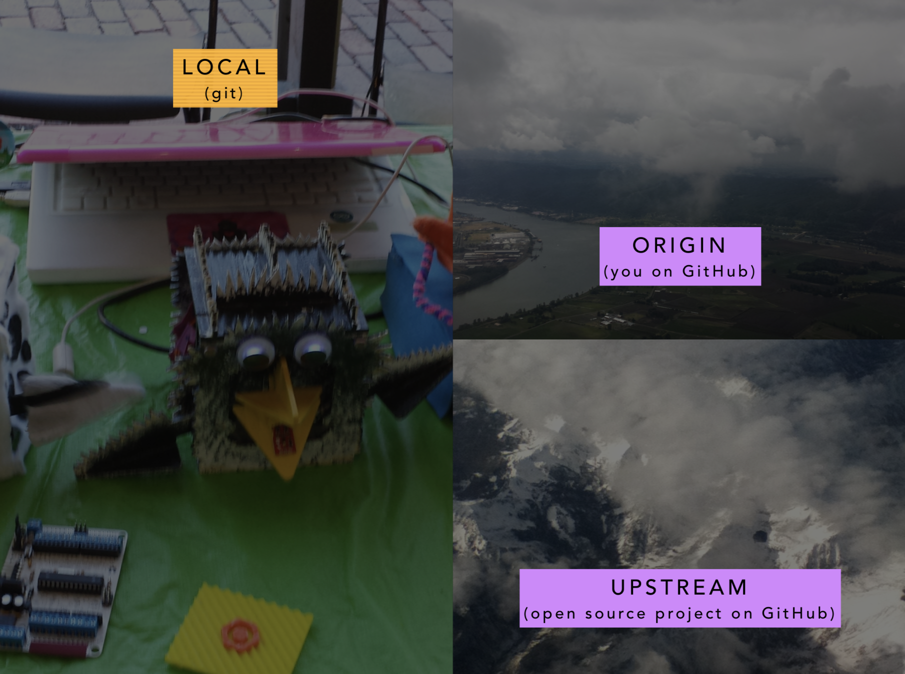
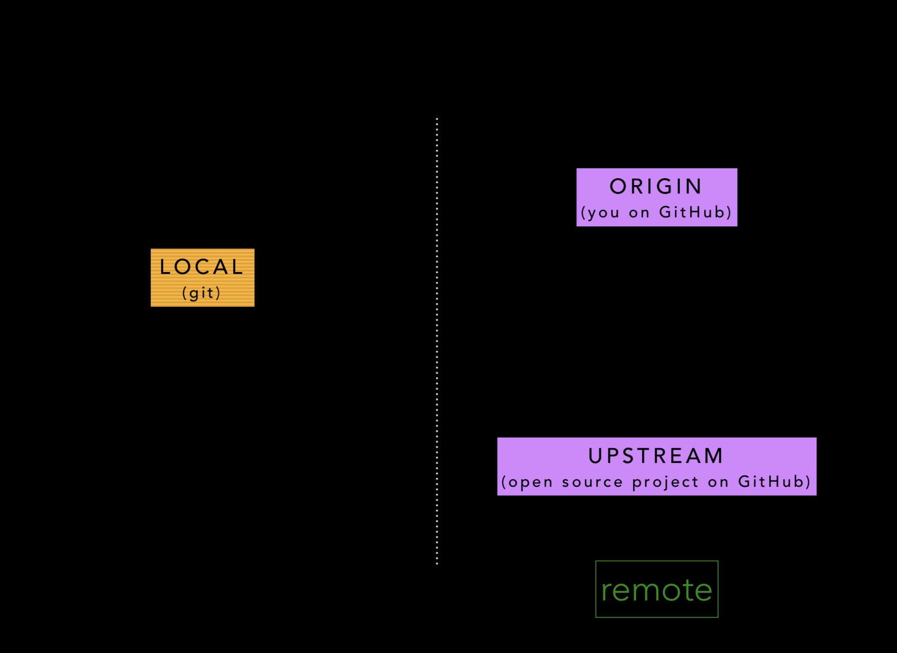
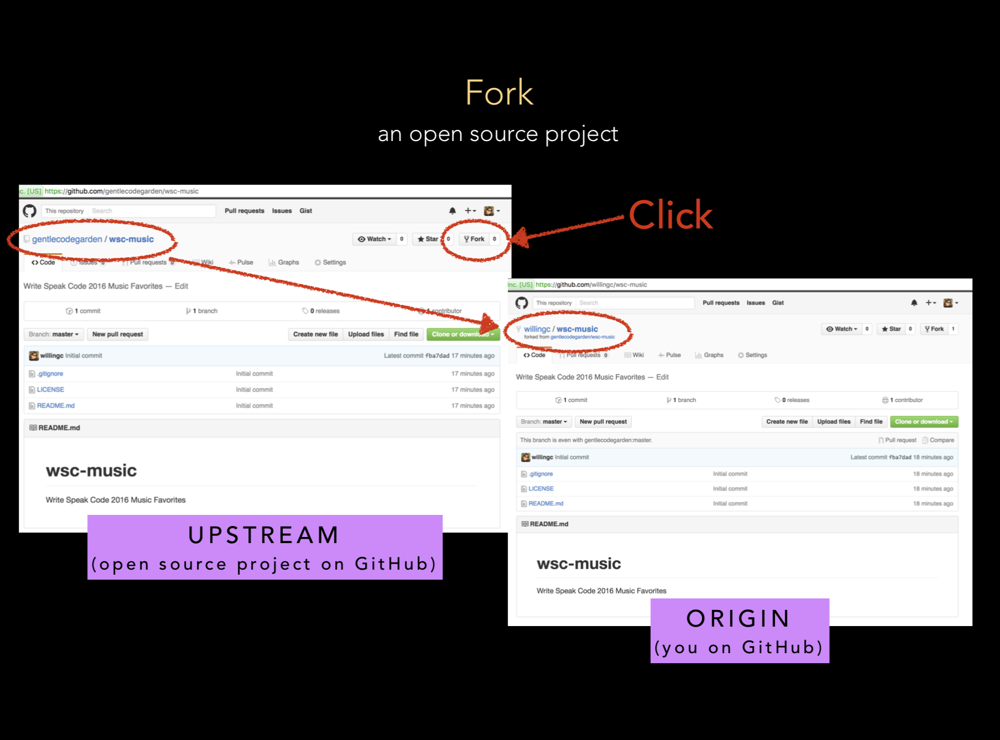
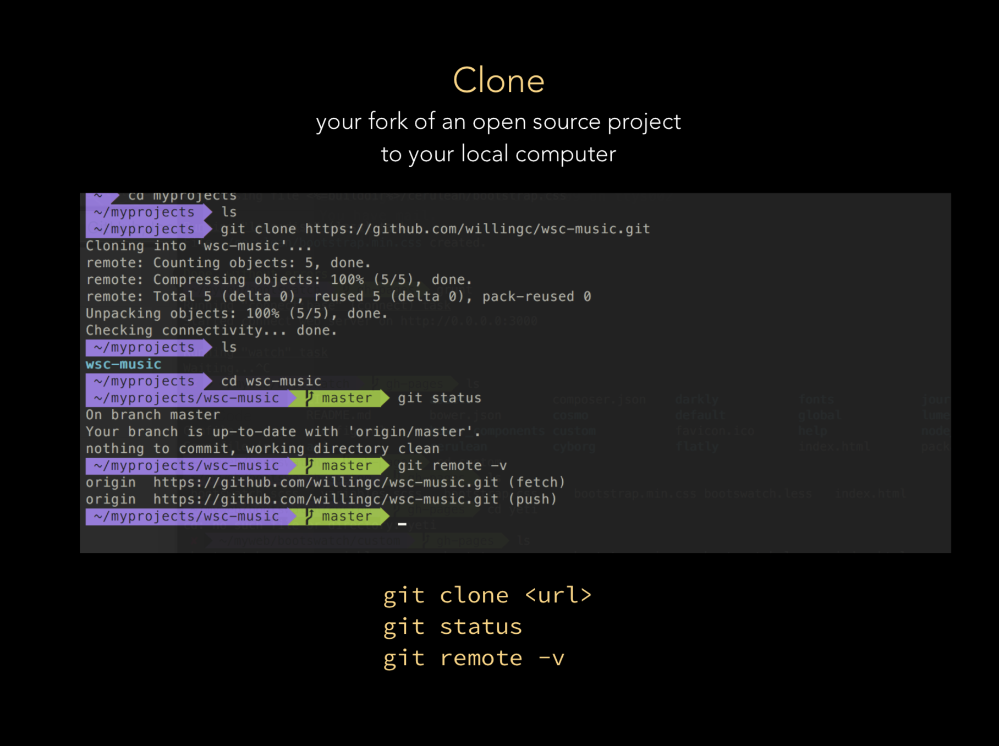
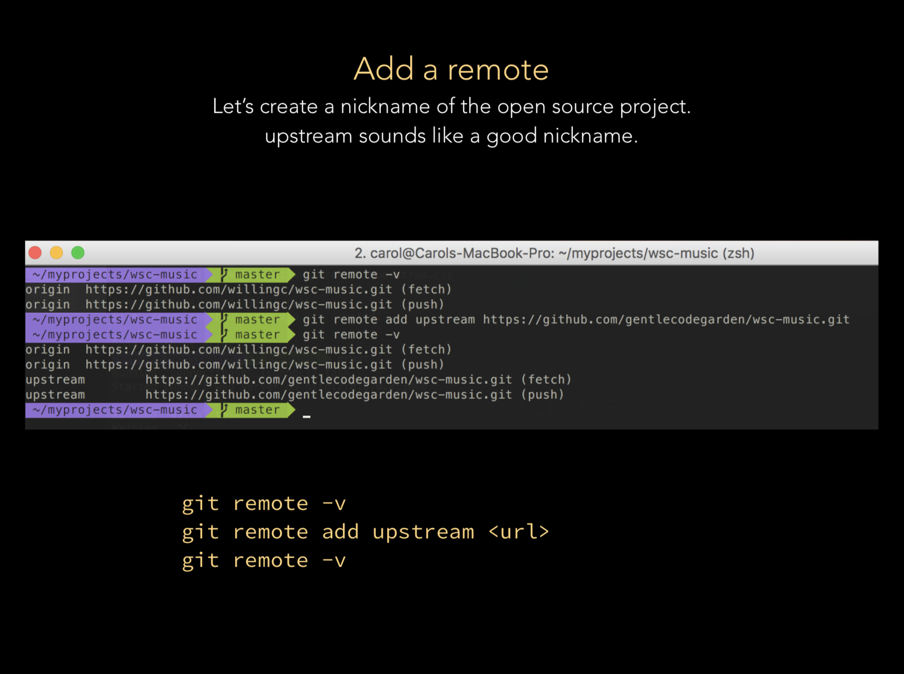
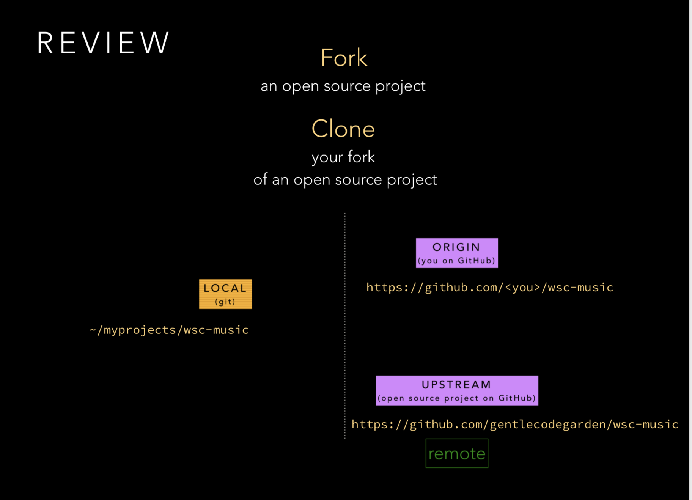

# Learning git: Locations, Remotes, and GitHub

When you are new to git and GitHub, one of the first things that is helpful to
learn is where your code is located. Do you want to contribute to open source
or a friend's project?

Two concepts will help you get started:

- The difference between git (tool) and GitHub (service)
- The location of code repositories and how to refer to them

<!-- more -->
---

_Inspired by a [talk given at Write Speak Code 2016](https://www.slideshare.net/willingc/yes-you-can-git)._

---

## Tool and Service

**[git](https://git-scm.com/docs/)** is an open source tool which can be installed on a variety of computer systems.

**[GitHub](https://github.com)** is a cloud service that stores source code repositories.

## Understanding Repository Locations

By understanding this concept, your mastery of git and GitHub for development will advance quickly.

The old saying, _"Naming is hard."_, definitely applies to git. While a handy tool, the jargon around using git makes it difficult for a new user to grasp concepts.

First, let's look at three locations: `local`, `origin`, and `upstream`. Code can be stored in all of these locations.

Let's start with `local`. The `local` location is the `git` tool running on your computer system.

For consistency, we will name the repository location of your account on GitHub, `origin`.

Finally, we will refer to the open source project's repository with the location, `upstream`.

## What is a fork?

The process of creating a copy of an open source project and locating it in your GitHub account is called `forking`. In the GitHub user interface, you would do this by navigating to the open source project page and clicking the fork button.

## Getting a project's code onto a local system

The process of cloning makes a replica of the repository located at the specified URL: `git clone <URL>` where `<URL>` is the repository's project page that you wish to clone.

## Listing and adding remotes

A **remote** is the term that git uses to refer to any repository located in version control outside of your local computer.

`git remote -v` will print all of the remotes that a local repository has access to. In this example, you can see that there is only one remote, `origin`, which corresponds to the repository on my GitHub account.

To add a path from local to the `upstream` open source project, we need to tell git where the location of the open source project is. We can do this with the command: `git remote add upstream <URL>` where `<URL>` is the open source project's repository that you to have a path accessible from `local`.

## Recap

Remember:

- git is a tool
- GitHub is a service
- remotes are locations of different repositories
- local usually refers to your local computer
- remotes, often `origin` and `upstream`, are other repositories which are located somewhere different from local

There is still lots to learn about git and GitHub workflows. I hope this gives you a foundation to build upon.
