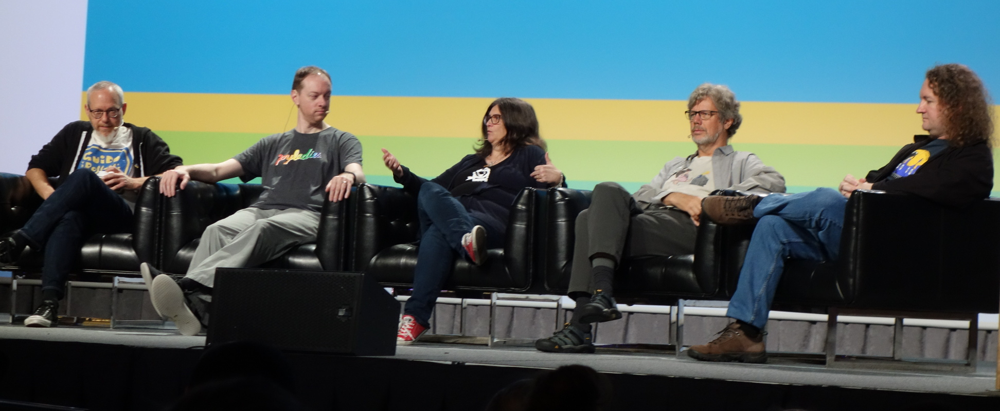

# Serving on the Inaugural Python Steering Council

**The successful release of Python 3.8 (thanks Łukasz and everyone who contributed) begins a new chapter for the
Python Steering Council.** Under the new governance of core development, described in
[PEP 13](https://www.python.org/dev/peps/pep-0013/#electing-the-council), a new Steering
Council is elected after each major release cycle.
<!-- more -->
## Where can I read about being a Steering Council member

- [PEP 13](https://www.python.org/dev/peps/pep-0013)
- [Brett's recent post](https://snarky.ca/what-its-like-to-be-on-the-python-steering-council/),
  _What It's Like to Be on the Python Steering Council_. Brett's post does a great job of describing our processes,
  time estimates, and description of work. I think his post accurately reflects my experience as a council member too.
- The public [Steering Council repo](https://github.com/python/steering-council#steering-council). It contains an
  onboarding document which we hope will help new Council Members. It includes links out to other Python governance
  resources and PEPs. There's also a summary from an external non-profit resource with some tips on
  [effective governance](https://github.com/python/steering-council/blob/master/process/best-practices.md).

## Tell me about a Steering Council meeting

### _How often do you meet?_

This year, the Steering Council has held one hour weekly meetings. As we worked through the backlog of PEPs, we
found meeting weekly was a good cadence. Since it was working well, we kept the weekly schedule.

### _What gets discussed?_

Our discussions focus around our agenda each week. The weekly agenda covers the following areas:

- PEPs
- Projects
- Processes
- Other

The agenda is designed to reflect the core responsibilities of the Steering Council as written in PEP 13.

### _What if you miss a meeting?_

Though we have made attending the meetings a high priority, there are times when travel and life prevent someone from
attending. We have an agenda for each meeting which has the same format each week (_we use a GitHub issue template for
the baseline agenda_). If you will miss a meeting, you can add comments on the agenda beforehand.

Minutes are taken during each meeting, and all are published to a private Steering Council repo. We use a Skype call
for meeting so that we can see each other while we discuss topics and we can share screens if needed.

After each meeting, we create a GitHub issue for each action item that comes out of the regular
meeting. We've found using issues for action items to be very helpful and productive.

## What does the Steering Council do in-between meetings?

In between meetings, the Council works on action items from the prior meeting and ongoing special projects. We discuss
and share information on the mailing list, PEPs, and Discourse.

## How has the Council been working out so far?

I believe that we have found a good process for preparing, running, and following up on meetings. We've tried to do as
much as possible in public communication channels. It's been our goal to provide reports out to the core development
community every couple of months. I believe that we can improve the frequency of these reports in the future.

Ewa and the PSF Team have been very helpful in supporting us this year. Thanks Ewa and team for the organizational help
and insights that you shared. It has been a team effort.

## Should I run in the election to be a part of Steering Council?

Yes! If you have a strong interest in serving, I would go ahead and nominate yourself. Different interests,
experience, and viewpoints strengthen the Council and improves its effectiveness. Details on nominations can be
found on [Discourse](https://discuss.python.org/t/about-the-steering-council-nominations-category/2459).

One helpful thing to keep in mind is that the Steering Council represents all of the
core developers. The Council also works to sustain and improve the language, support good
processes for core development, and to foster a healthy future for Python.

## Wrap Up

To Barry, Brett, Guido, and Nick, thanks for your dedication and thoughtfulness through this transition to the new
governance structure. I'm glad that we worked so well together as a team.

The next Steering Council will be starting in a good place. I'm looking forward to supporting the next Steering Council,
their work in 2020, and the bright future of Python.

_Photo credit: LWN.net_

