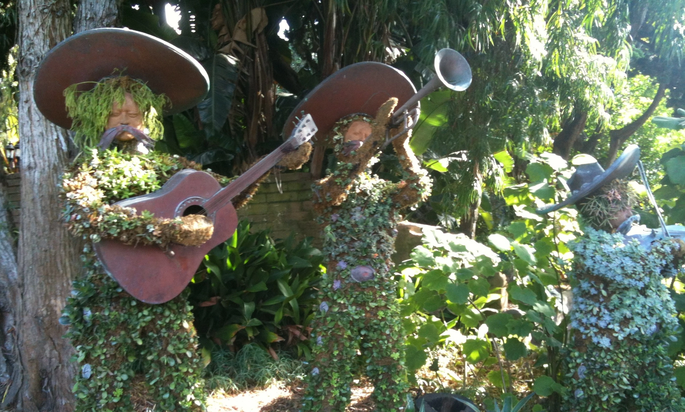

## Learn | Build | Share

**Open learning** and **open source development** empower individuals to create
meaningful change and innovation. Together, we can improve access to scientific
information and **build knowledge** from open data.

## Blog
